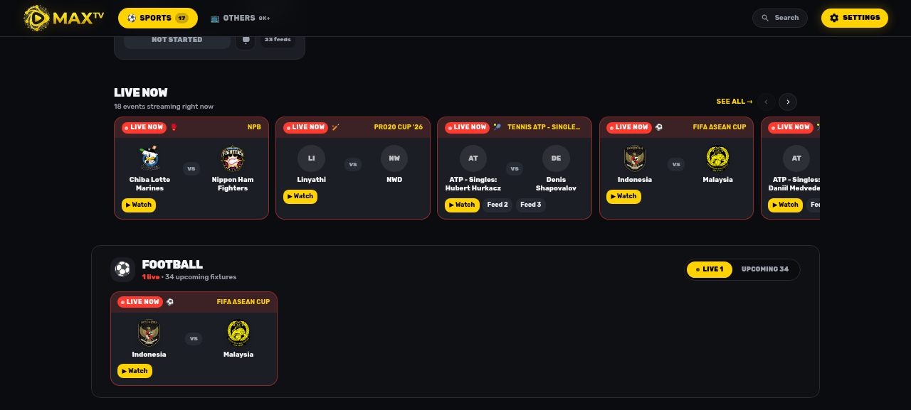
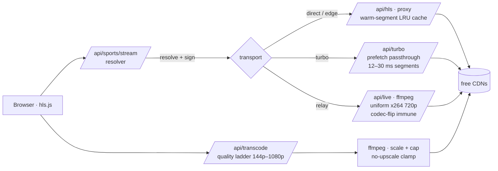
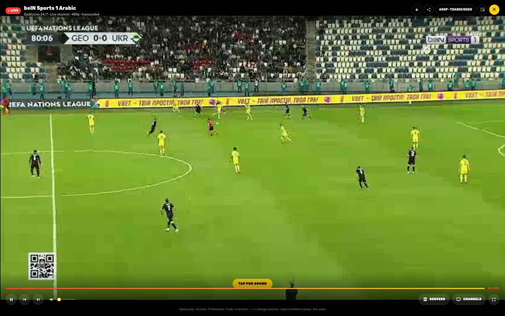
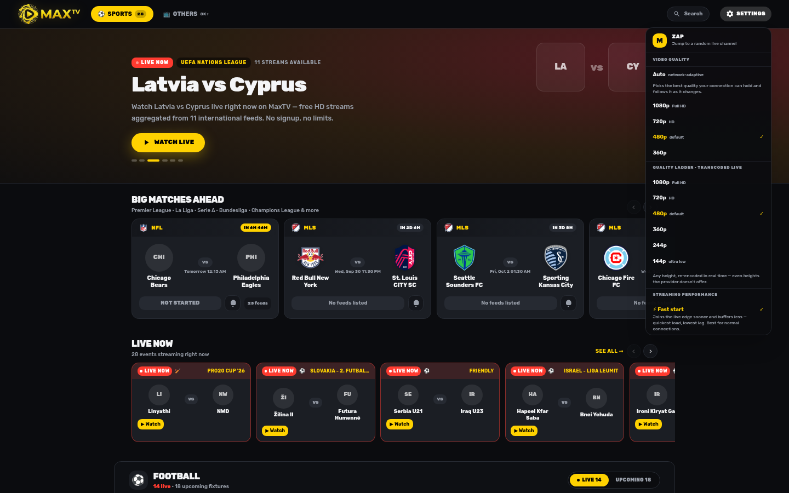
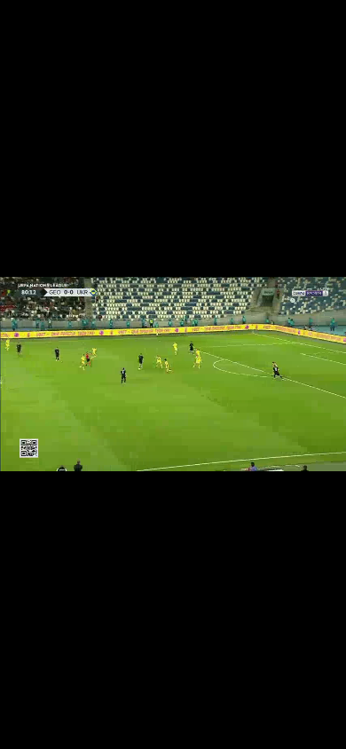

<div align="center">


**Live sports & free IPTV — a self-hosted, Pluto TV–style streaming experience.**

[](https://nextjs.org)
[](https://react.dev)
[](https://www.typescriptlang.org)
[](https://github.com/video-dev/hls.js)
[](LICENSE)

[Features](#-features) · [Architecture](#-architecture) · [Quickstart](#-quickstart) · [Configuration](#%EF%B8%8F-configuration) · [Engineering notes](#-engineering-notes)

</div>

---

MaxTV turns a pile of free HLS feeds — DaddyLive sports mirrors, Pluto TV, Tubi, Samsung TV Plus, Roku, Stirr, Plex and 20+ more IPTV playlists — into one fast, couch-friendly live TV app: a zapping remote, a guide, live-match rails, real server failover, a genuine real-time quality ladder and network-adaptive playback.

It is built around one core idea: **free CDN streams are unreliable, so reliability has to be an engineering feature of the player, not an afterthought.** The result is a multi-transport streaming engine that absorbs CDN flaps, mid-stream codec flips, timestamp chaos and dead mirrors — and keeps playing.

<p align="center">
  
</p>

## ✨ Features

**Watching**
- 🏟 **Live sports first** — fixtures schedule, "big matches ahead" rails, per-event multi-feed cycling and beIN Sports Arabic priority for football
- 📺 **8,000+ free channels** across 20+ aggregated IPTV playlists, auto-repaired (dead URLs pruned, formats normalized) and searchable
- 🌍 **World Sports rail** — 75+ curated sports networks (F1, FIFA+, NFL, NHL, PGA, Red Bull TV, beIN XTRA…) where *every* stream is verified to ship a real ABR ladder, so the quality menu always offers 3–7 genuine rungs
- 🎛 **Real quality control** — native provider ladders *plus* a server-side **Data saver** ladder at **144p → 1080p**, with **480p as the tuned default** and per-height bitrate caps
- 🔀 **Multi-quality sources per channel** — DaddyLive channels list "More sources · multi-quality" in the servers menu: the same network carried by ladder-bearing providers (World Sports, beIN, Plex, Samsung TV+…) with smart name matching ("beIN Sports MENA English 1" ≡ "beIN Sports 1" ≡ "beIN SPORTS XTRA")
- 📶 **Network-adaptive playback** — the connectivity engine watches live fragment throughput and moves you between rungs; `Auto` mode seeds from the browser's own estimate
- 🖥 **Pluto TV–style UX** — channel-surfing remote with number keys, mini guide, recently-watched, PiP, fullscreen, keyboard shortcuts, live-edge indicator

**Resilience (the interesting part)**
- 🔀 **11 genuinely different transports** per stream — direct CDN, edge-direct, mirror-routed direct, an in-memory prefetching cache ("Turbo"), and bulletproof transcode relays — with automatic failover that walks the list
- 🩹 **Honest error states** — dead channels fail fast to an actionable screen (retry / switch server / browse / close) instead of infinite spinners, then auto-advance to the next live channel
- 🛡 **Serverless-aware** — deployments without ffmpeg (e.g. Vercel) detect it via a capability probe, gracefully stay on the native feed, point users at multi-quality sources instead, and say so in the quality menu; DaddyLive playlist refreshes that the edge CDN 403s (rotating serverless egress IPs) are recovered by a transparent server-side re-resolve
- 👁 **Vision mismatch guard** — a frame from the feed is checked against the sport you opened; if the network preempted your match, the player offers a one-click hop to the event's next feed

**Polish**
- 🚀 Fast start by default, with a "Rock steady" profile for weak connections
- 📱 Fully responsive down to 390px, picture-in-picture, persisted preferences
- 🧭 Session-stamped playlists and an LRU warm-segment cache to kill disk-cache poisoning

## 🏗 Architecture

Everything is a Next.js App Router project — the browser never talks to third-party CDNs directly; every stream flows through server-side routes that resolve, unwrap, cache and (when needed) re-encode.



| Transport | What it does | When it wins |
|---|---|---|
| **Direct / Edge** | Proxied pass-through with speculative prefetch of the 3 newest segments into an LRU cache | Lowest latency, CDN healthy |
| **Turbo cache** | Poller + parallel prefetch, de-steganographed segments, own clean playlist window | Flappy CDNs — segments serve locally in ~12–30 ms |
| **Relay** | ffmpeg re-encode to uniform H.264 | Provider flips codecs/timestamps mid-stream |
| **Transcode ladder** | Real-time 144p–1080p rungs with ffprobe-based no-upscale clamping | Quality control & data saving |

The **quality system** has three coordinated layers: the client picks a rung, a probe endpoint reports the source's true resolution (single-rendition playlists don't declare it), and the encoder clamps to `min(requested, source)` — so upscaling is impossible by construction and every listed quality is a real, deliverable one.

## 🚀 Quickstart

**Prerequisites**

- Node.js ≥ 20 (or Bun ≥ 1.1)
- `ffmpeg` + `ffprobe` on `PATH` — required by the relay transport and the transcode ladder

```bash
git clone https://github.com/mahmoudmohamedxx1-hue/maxtv.git
cd maxtv

bun install        # or: npm install

bun run dev        # or: npm run dev  →  http://localhost:3000
```

**Production**

```bash
bun run build      # next build + standalone assembly
bun run start      # NODE_ENV=production node .next/standalone/server.js
```

## ⚙️ Configuration

All environment variables are optional — see [`.env.example`](.env.example):

| Variable | Default | Purpose |
|---|---|---|
| `HLS_SIGN_SECRET` | random per process | HMAC secret for signed `/api/hls` source URLs; set a fixed value in production so links survive restarts |
| `PORT` | `3000` | Standalone server port |

CPU note: the transcode ladder and relay encode with `x264 ultrafast`. A 2-core box comfortably sustains 480p (the default); give the host more cores if you expect several concurrent 720p/1080p viewers.

## 📁 Project structure

```
src/
├── app/
│   ├── api/
│   │   ├── hls/            # proxied direct transport + warm-segment cache
│   │   ├── turbo/          # prefetching passthrough transport
│   │   ├── live/           # ffmpeg relay transport
│   │   ├── transcode/      # quality-ladder sessions (144p–1080p)
│   │   ├── sports/         # schedule, channels, stream resolution
│   │   ├── iptv/           # catalog + channel endpoints
│   │   ├── vision/sport/   # feed-vs-sport mismatch detection
│   │   └── img/ logo/ search/
│   └── layout.tsx · page.tsx
├── components/app/         # player overlay, guide, rails, nav, search
└── lib/
    ├── streaming/          # resolve · proxy · turbo · transcode · uncloak
    ├── sports/             # fixtures, feeds, beIN mapping, mirror racing
    ├── iptv/               # playlist parsing, repair, health probing
    └── player-settings.ts  # shared prefs + hls.js tuning profiles
data/iptv/                  # aggregated source playlists
docs/                       # screenshots
```

## 🔬 Engineering notes

Field-tested fixes worth reading before hacking on the player:

- **"Plays like 2×"** — hls.js's latency-controller ramps `playbackRate` toward 2× whenever the playhead falls behind the live-sync target. On flapping CDNs that fired after *every* stall. Fix: `lowLatencyMode: false` + `maxLiveSyncPlaybackRate: 1`, everywhere, unconditionally.
- **Transcode stalls after ~15 s** — ffmpeg's stderr was a pipe nobody read; the 64 KB buffer filled with discontinuity warnings and the encoder blocked. One `stderr.on('data')` drain fixed a "mystery" bug.
- **Codec flips mid-stream** — the premium provider rotates H.264 ↔ HEVC without discontinuity markers. Stream-copy remux produces undecodable output, so the relay re-encodes to uniform H.264 and a watchdog restarts the session on flips.
- **Segment steganography** — some CDNs cloak TS segments as PNG/WEBP or gzip. The input engine unwraps them before they reach ffmpeg or the browser.
- **URL-based dedup lies** — CDNs re-sign URLs on every playlist fetch, so segment identity is `MEDIA-SEQUENCE + position`, never the URL.
- **Cache poisoning** — segment URLs recycle `n=1,2,3…` across sessions; every playlist is session-stamped and served `no-store`, and stale-session requests 503 immediately for fast failover.

## 📸 More screenshots

<p align="center">
  
</p>
<p align="center">
  
  
</p>

## ⚠️ Disclaimer

MaxTV is a player and an aggregator: it **hosts no content** and simply links to third-party streams that are publicly available on the internet. It is intended for personal, educational use. No warranty is provided — use it responsibly and in accordance with the laws and the rights of the content owners in your jurisdiction.

## 📄 License

Released under the [MIT License](LICENSE).

<div align="center">
  <sub>Built with Next.js · React · hls.js · ffmpeg — and a lot of time spent watching flaky CDNs.</sub>
</div>
